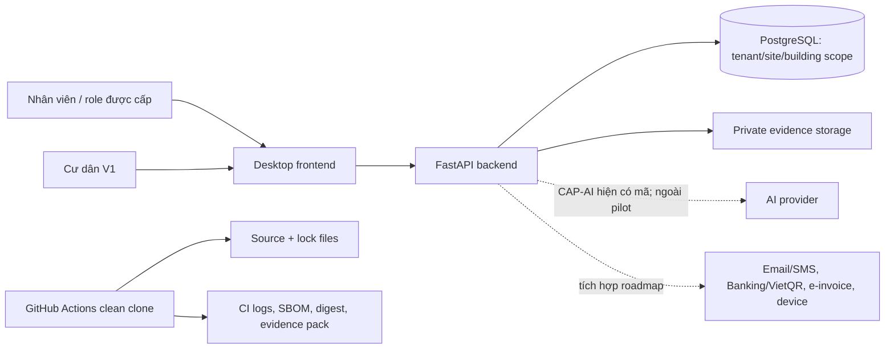

# OR-02 — Inventory hệ thống, tài sản và phân loại dữ liệu

## Phạm vi và data flow

Sơ đồ phân biệt rõ luồng đã có mã trong repository với những tích hợp chỉ mới
được roadmap dự kiến. Không suy diễn một connector từ việc nó xuất hiện trong
SRS.

## Inventory và phân loại

| Asset / dữ liệu | Phân loại | Owner chịu trách nhiệm | Steward vận hành | Điều kiện xử lý tối thiểu |
| --- | --- | --- | --- | --- |
| Account, session, role, tenant/site/building grant | Restricted | Tech Lead | Admin | Suy ra server-side; không tin role/scope từ client; thu hồi có hiệu lực request kế tiếp. |
| Person, Unit Relationship, liên hệ và giấy tờ cư dân | PII / Restricted | PO | CSKH | Chỉ dùng dữ liệu giả ở pilot; masking/field policy; không đưa vào log hay fixture công khai. |
| Service request, Work Order, maintenance, cleaning, patrol, incident | Confidential | Tech Lead | Trưởng bộ phận tương ứng | Tenant/site/building/assigned-only scope; audit/correlation; attachment private. |
| Invoice, payment, ledger, số dư | Financial / Restricted | Kế toán | Kế toán | Integer VND, immutable ledger, maker-checker; không dùng cho giao dịch thật trước phê duyệt nghiệp vụ. |
| Attachment, ảnh, evidence, checksum, signed link | Restricted | Tech Lead | Owner nghiệp vụ | Allowlist type/size/MIME, checksum, scoped access và expiry; không dùng shared drive công khai. |
| Audit event, correlation ID, log/metric | Confidential | Security | Tech Lead / Ops | Redact secret/PII; retention và quyền truy cập phải được xác nhận trước pilot. |
| `.env`, GitHub secret, database/provider credential | Secret | Tech Lead | DevOps | Chỉ backend/secret store; không commit, không log, không đưa vào SBOM/evidence. |
| Source, package lock, migration, build artifact, SBOM | Internal | Release Owner | DevOps | Version/tag, SHA-256 digest, scan và retention theo release checklist. |

## Third-party register

| Bên thứ ba | Tình trạng | Dữ liệu dự kiến/quan sát | Cơ chế tin cậy | Owner | Điều kiện trước khi bật |
| --- | --- | --- | --- | --- | --- |
| AI provider (Gemini) | Mã backend có capability assistant; phạm vi pilot chưa duyệt | Câu hỏi người dùng và context server-derived có thể đi ra provider | Key chỉ ở backend; không đặt trong frontend | PO + Tech Lead | DEC-P1-01, quota/retention/kill-switch và security review ở Phase 2. |
| PostgreSQL/Aiven | Có cấu hình/backend adapter; deployment thực tế chưa được chứng minh bởi gói này | Dữ liệu nghiệp vụ và grant | TLS, role tách biệt là mục tiêu Phase 3 | DBA + Tech Lead | Runtime/migration role tách, CA verify-full và restore rehearsal. |
| Email/SMS/Push | Chỉ được roadmap nêu | Notification metadata/nội dung | Chưa có connector được baseline | Ops | Register hợp đồng, DPA/retention, retry/outbox và test. |
| Banking/VietQR/e-invoice | `SPEC-ONLY` / V1 theo roadmap | Dữ liệu thanh toán/hóa đơn | Không có quyền hoặc credential trong repository | Kế toán + PO | Owner nghiệp vụ xác nhận và Phase 2–3 controls. |
| Device / access-control provider | Chỉ được roadmap nêu | Sự kiện thiết bị/khu vực | Không có connector được baseline | Security + Ops | Threat review, network boundary, audit và fallback manual. |
| GitHub Actions, npm, PyPI | Dùng để build/scan trong CI | Source metadata, lockfile, output scan | Token quyền tối thiểu; action/tool version được review | DevOps | Một run clean clone và policy allowlist của repository (nếu có). |

## RACI Phase 1

`A` = accountable, `R` = thực hiện, `C` = tham vấn, `I` = được thông báo.

| Deliverable | PO | Tech Lead | Security | BE | DevOps | QA | Release Owner | Kế toán / Ops |
| --- | --- | --- | --- | --- | --- | --- | --- | --- |
| DEC-P1-01..04 baseline | A/R | A/R | C | C | I | C | I | C |
| Asset/data inventory | A | R | A/R | C | C | I | I | C |
| Threat model & risk register | C | R | A/R | R | C | C | I | C |
| CI quality/security gate | I | A | C | C | R | R | I | I |
| Release/change control | I | C | C | I | R | C | A/R | C |
